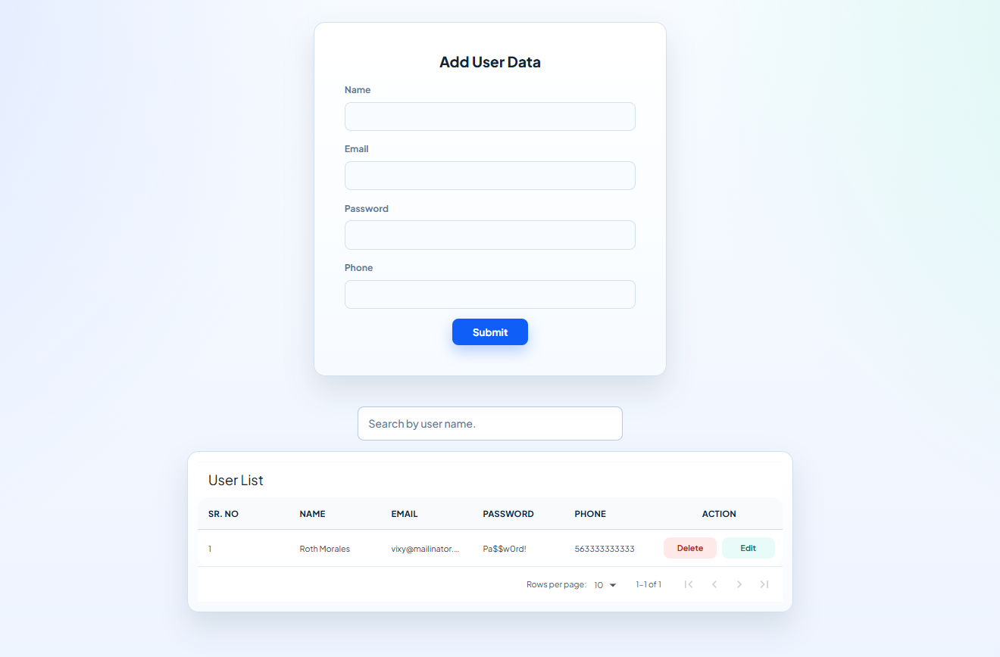

# CRUD User Management Dashboard

[](https://nextjs.org/)
[](https://react.dev/)
[](https://getbootstrap.com/)
[](#license)

A modern user CRUD dashboard built with Next.js App Router.
The app lets you create, view, update, delete, and search users with a clean responsive interface and browser-based storage.

## Screenshot



The screenshot includes:
- `Add User Data` form with `Name`, `Email`, `Password`, and `Phone` fields
- Search input to filter users by name
- `User List` table with pagination and `Edit`/`Delete` actions

## Tech Stack

- Next.js 16 (App Router)
- React 19
- Bootstrap 5
- `react-data-table-component`
- `react-toastify`
- Mongoose (API route layer available in the project)

## Features

- Create new users
- List users in a paginated table
- Edit users with pre-filled form values
- Delete users
- Search users by name
- Toast notifications for CRUD actions
- Data persistence in browser `localStorage`
- Responsive layout for desktop, tablet, and mobile

## Run Locally

1. Install dependencies:

```bash
npm install
```

2. Start development server:

```bash
npm run dev
```

3. Open:

```text
http://localhost:3000
```

## Available Scripts

```bash
npm run dev
npm run build
npm run start
```

## Folder Structure

```text
app/
  api/
    users/
      route.js
      [id]/route.js
  configs/
    database.js
  models/
    users.model.js
  globals.css
  layout.js
  page.js
```

## Data Persistence

User records are stored in browser `localStorage` under:

```text
users_data
```

To reset records, clear browser local storage for this site.

## Notes

- Current UI CRUD flow works without backend DB calls.
- MongoDB API routes remain in the project if you want server persistence later.

## License

MIT
